<p align="center">
  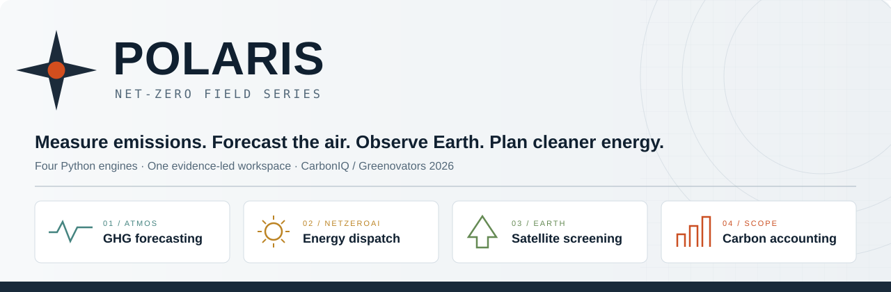
</p>

<p align="center">
  <a href="https://polaris-web-production-bb75.up.railway.app"></a>
  <a href="https://github.com/neevmodh/Polaris"></a>
  
  
</p>

<h1 align="center">POLARIS · Net-zero field series</h1>

<p align="center"><strong>Four environmental tasks. Four Python engines. One decision workspace.</strong><br>Greenovators Hackathon 2026 · Track 3 · Team CarbonIQ</p>

POLARIS connects industrial carbon accounting, regional greenhouse-gas forecasting, satellite change screening and renewable microgrid planning. Its Next.js interface calls the actual Python engines, displays their evidence and assumptions, and offers an optional analyst to explain computed results.

**Start here:** [Live dashboard](https://polaris-web-production-bb75.up.railway.app) · [Quick start](#quick-start) · [Architecture](#system-architecture) · [Models](#model-scorecard) · [Datasets](#dataset-catalog) · [Proposal](docs/Polaris_Final_Round_Proposal.pdf)

> **Prototype status:** air and satellite workflows use real environmental observations or model products. Carbon gap-filling and default microgrid training use synthetic demonstration data. Satellite outputs are screening signals. Read the [evaluation](#model-scorecard) and [limits](#interpretation-and-current-limits) before quoting a result.

<details>
<summary><strong>Contents</strong></summary>

- [Four tasks at a glance](#explore-the-four-tasks) and [screenshots](#screenshots)
- [System architecture](#system-architecture), request lifecycle and task relationships
- [Task 1: greenhouse-gas forecasting](#task-1-air)
- [Task 2: renewable microgrid](#task-2-microgrid)
- [Task 3: satellite forest and lake monitoring](#task-3-earth)
- [Task 4: industrial carbon accounting](#task-4-carbon)
- [Model scorecard](#model-scorecard) and [dataset catalog](#dataset-catalog)
- [Quick start](#quick-start), [API index](#workspace-and-api-index) and [deployment](#deployment)
- [Verification](#verification-and-reproducibility), [repository layout](#repository-layout) and [limits](#interpretation-and-current-limits)
- [Project documents and credits](#project-documents-and-credits)

</details>

## Explore the four tasks

| Task | Question answered | Engine / models | Main outputs |
|---|---|---|---|
| **1 · Localized greenhouse gases** | What might regional CO₂ above Noida or Ahmedabad do next? | [Atmos](task1/README.md): Seasonal Ridge, Lag Ridge, Random Forest; persistence benchmarks | 7 / 14 / 30-day forecasts, error bands, backtests, statistical alerts |
| **2 · Solar & wind microgrid** | How should renewable supply, a battery and grid imports carry demand? | [NetZeroAI](netzero-ai/README.md): three XGBoost forecasters → Pyomo / HiGHS linear optimization | Hourly dispatch, SOC, cost / carbon KPIs, curtailment and unserved load |
| **3 · Satellite monitoring** | Where did vegetation or lake optical signals change? | [Satellite Monitor](Task3/README.md): Random Forest + NDVI; optional U-Net water segmentation | Candidate forest-loss regions, water extent, spectral proxies, review and geospatial exports |
| **4 · Industrial carbon footprint** | What are the site's Scope 1, 2 and 3 emissions, and what could reduce them? | [SCOPE](SCOPE/README.md): factor accounting, ML gap-filling, uncertainty and planning | Scope breakdown, estimates, comparisons, reports, abatement, dispatch and fuel runway |

## Screenshots

Actual application screenshots, combining the unified website with the standalone satellite workspace. Individual engine interfaces expose additional tools.

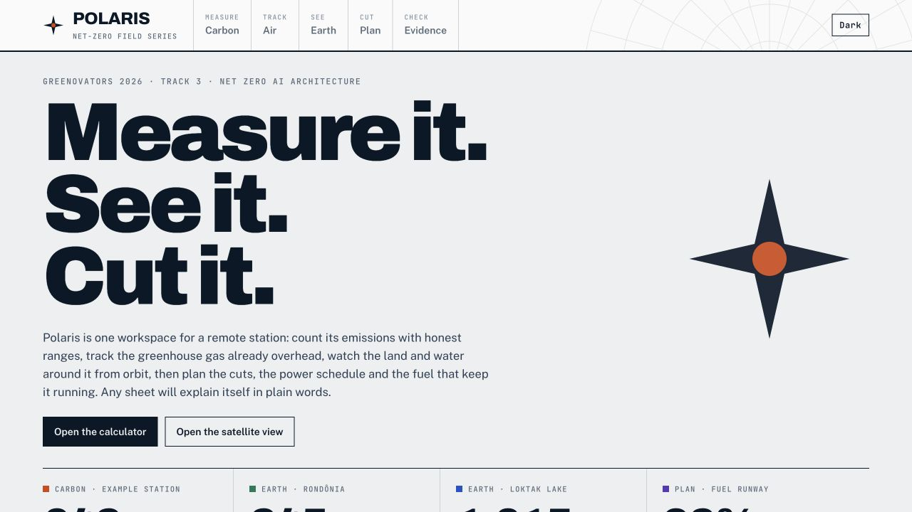

| Carbon accounting | Regional CO₂ forecasting |
|---|---|
| 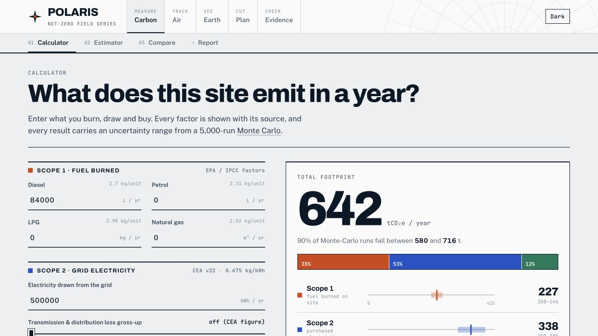 | 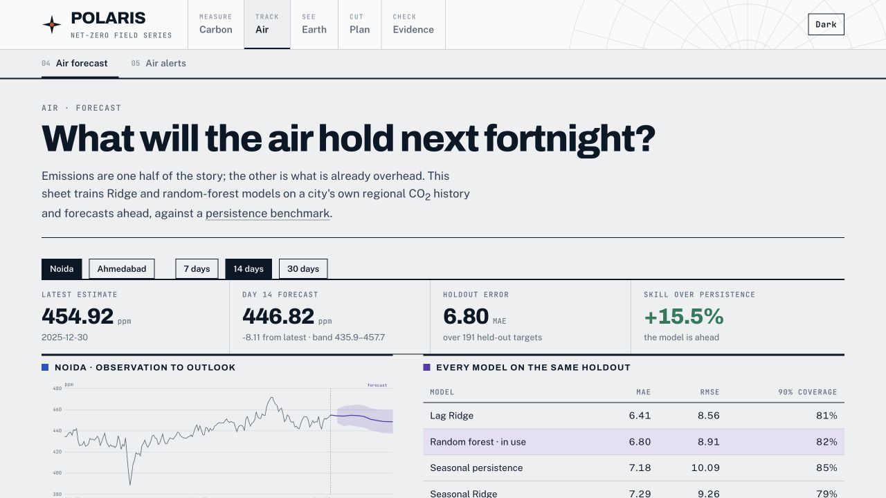 |
| [Open Carbon](https://polaris-web-production-bb75.up.railway.app/carbon) | [Open Air](https://polaris-web-production-bb75.up.railway.app/air/forecast) |

| Renewable microgrid | Satellite forest workspace |
|---|---|
| 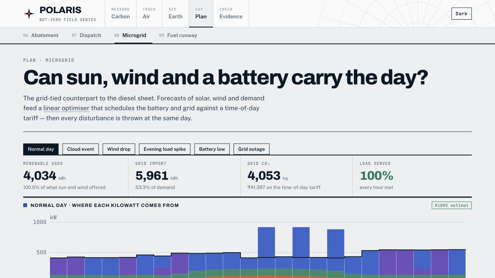 | 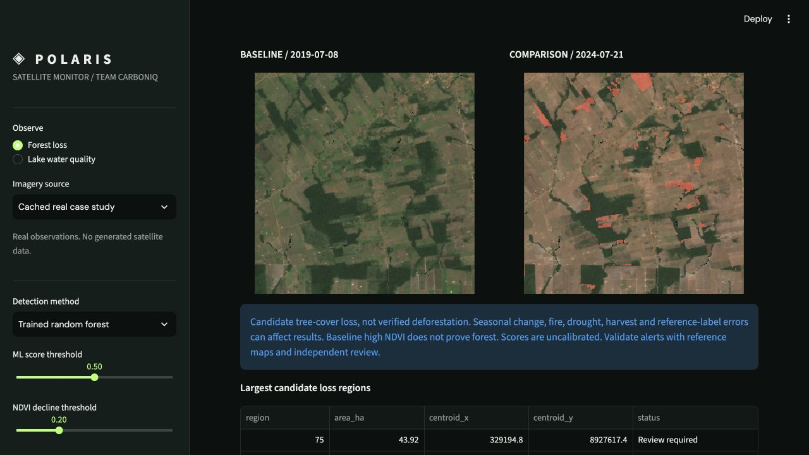 |
| [Open Microgrid](https://polaris-web-production-bb75.up.railway.app/plan/microgrid) | [Open Earth](https://polaris-web-production-bb75.up.railway.app/earth/forest) |

<details>
<summary><strong>More pictures: lake monitoring, maps and model explanations</strong></summary>

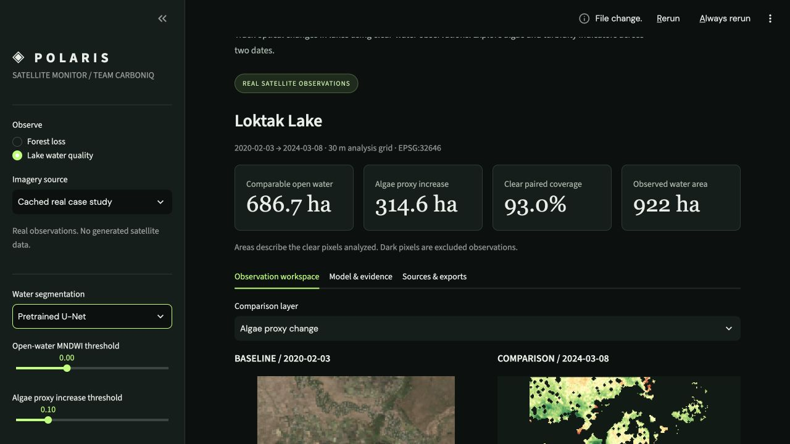

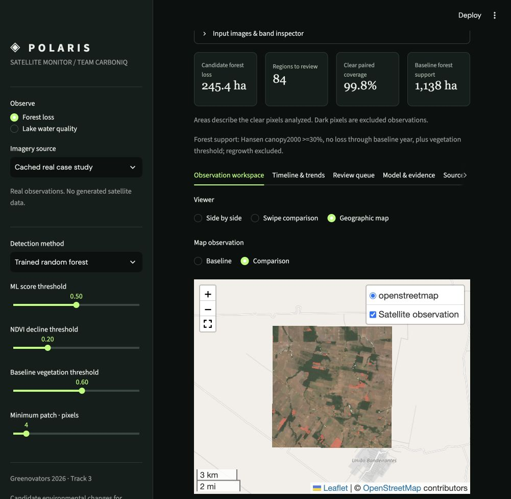

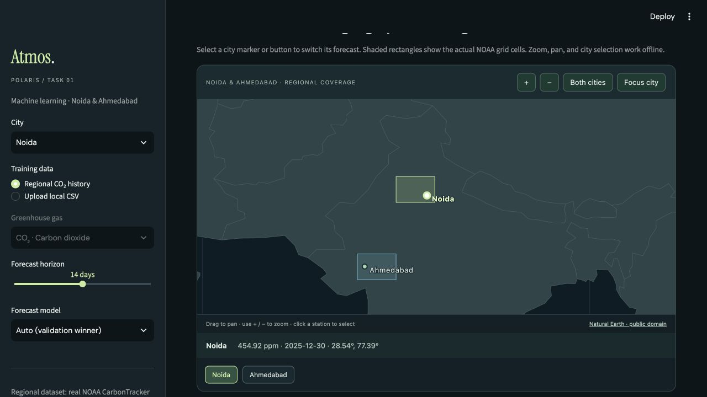

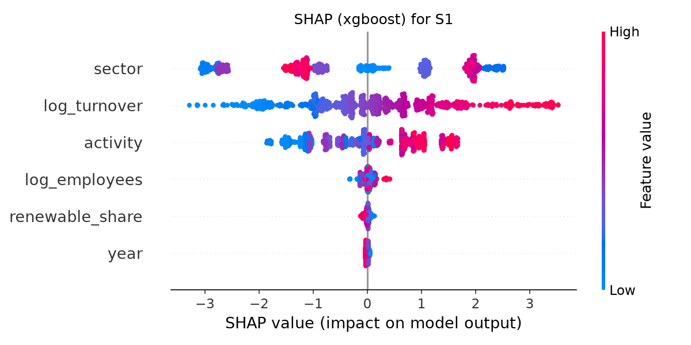

</details>

## System architecture

The website uses **Next.js 16.4, React 19.3 and TypeScript**. Python handles scientific computation. The bridge lazily starts persistent workers, exchanges JSON Lines through standard input/output, correlates request IDs and returns structured results or errors. Each local worker uses its own virtual environment and project working directory.

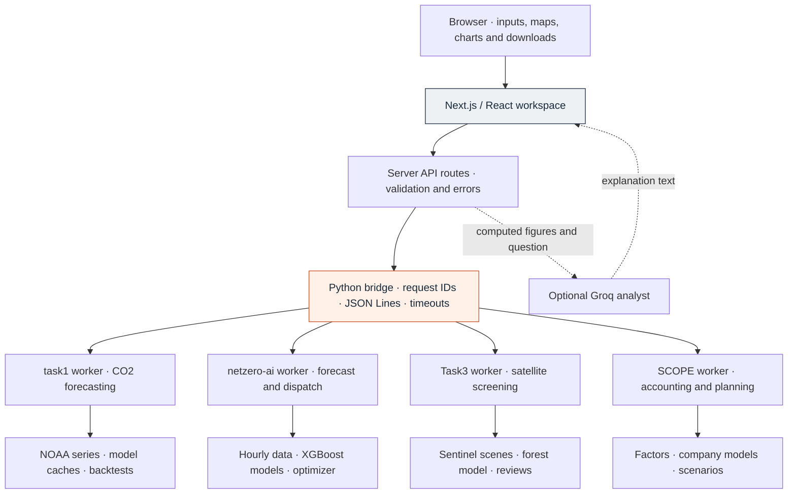
```mermaid
flowchart TB
    User["Browser · inputs, maps, charts and downloads"] --> Web["Next.js / React workspace"]
    Web --> API["Server API routes · validation and errors"]
    API --> Bridge["Python bridge · request IDs · JSON Lines · timeouts"]
    Bridge --> Air["task1 worker · CO2 forecasting"]
    Bridge --> Grid["netzero-ai worker · forecast and dispatch"]
    Bridge --> Earth["Task3 worker · satellite screening"]
    Bridge --> Carbon["SCOPE worker · accounting and planning"]
    Air --> AD["NOAA series · model caches · backtests"]
    Grid --> GD["Hourly data · XGBoost models · optimizer"]
    Earth --> ED["Sentinel scenes · forest model · reviews"]
    Carbon --> CD["Factors · company models · scenarios"]
    API -. "computed figures and question" .-> Analyst["Optional Groq analyst"]
    Analyst -. "explanation text" .-> Web
    style Web fill:#edf1f4,stroke:#192a3a,color:#192a3a
    style Bridge fill:#fff0e8,stroke:#cb4f22,color:#192a3a
```

**Implementation:** [bridge](Polaris/web/lib/py.ts) · [API routes](Polaris/web/app/api) · [worker adapters](Polaris/engines) · [navigation](Polaris/web/lib/sheets.ts).

### Request lifecycle

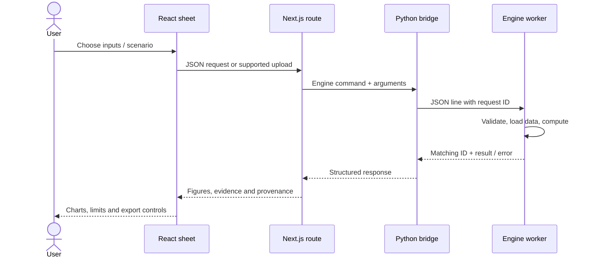
```mermaid
sequenceDiagram
    actor U as User
    participant UI as React sheet
    participant API as Next.js route
    participant B as Python bridge
    participant P as Engine worker
    U->>UI: Choose inputs / scenario
    UI->>API: JSON request or supported upload
    API->>B: Engine command + arguments
    B->>P: JSON line with request ID
    P->>P: Validate, load data, compute
    P-->>B: Matching ID + result / error
    B-->>API: Structured response
    API-->>UI: Figures, evidence and provenance
    UI-->>U: Charts, limits and export controls
```

### How the tasks relate

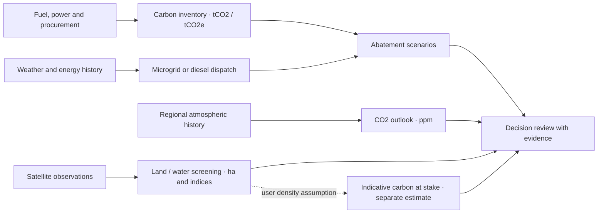
```mermaid
flowchart LR
    Activity["Fuel, power and procurement"] --> Mass["Carbon inventory · tCO2 / tCO2e"]
    Mass --> Cuts["Abatement scenarios"]
    Weather["Weather and energy history"] --> Plan["Microgrid or diesel dispatch"]
    Plan --> Cuts
    NOAA["Regional atmospheric history"] --> Air["CO2 outlook · ppm"]
    Scenes["Satellite observations"] --> Land["Land / water screening · ha and indices"]
    Land -. "user density assumption" .-> Indicative["Indicative carbon at stake · separate estimate"]
    Cuts --> Review["Decision review with evidence"]
    Air --> Review
    Land --> Review
    Indicative --> Review
```

Atmospheric concentration is not an emissions inventory. Candidate hectares are not verified emissions. The forest sheet's optional carbon-at-stake calculation uses assumed carbon density and release share, kept separate from the industrial footprint.

<a id="task-1-air"></a>

## Task 1 · Localized greenhouse-gas forecasting

**Prepared locations: Noida and Ahmedabad, India.** Each cached series contains **1,460 daily values**, from **2022-01-01 to 2025-12-30**, extracted from NOAA CarbonTracker **CT2026**. Eight three-hourly pressure-averaged boundary-layer CO₂ estimates are averaged by UTC day.

| Location | Requested coordinates | Native grid-cell centre | Native grid footprint |
|---|---|---|---|
| Noida | 28.5355° N, 77.3910° E | 29° N, 76.5° E | 75–78° E, 28–30° N |
| Ahmedabad | 23.0225° N, 72.5714° E | 23° N, 73.5° E | 72–75° E, 22–24° N |

The native resolution is **3° longitude × 2° latitude**. These are regional modeled concentrations, not city sensors or street-level readings. The cached forecast begins **2025-12-31**, after the last historical value; it is not a live forecast from today's date.

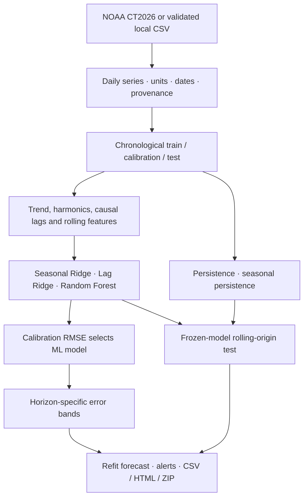
```mermaid
flowchart TB
    N["NOAA CT2026 or validated local CSV"] --> D["Daily series · units · dates · provenance"]
    D --> Split["Chronological train / calibration / test"]
    Split --> F["Trend, harmonics, causal lags and rolling features"]
    F --> M["Seasonal Ridge · Lag Ridge · Random Forest"]
    Split --> Base["Persistence · seasonal persistence"]
    M --> Cal["Calibration RMSE selects ML model"]
    Cal --> Band["Horizon-specific error bands"]
    M --> Test["Frozen-model rolling-origin test"]
    Base --> Test
    Band --> Out["Refit forecast · alerts · CSV / HTML / ZIP"]
    Test --> Out
```

| Component | Implementation |
|---|---|
| Seasonal Ridge | Trend and annual harmonics capture broad seasonal structure |
| Lag Ridge | Regularized regression over historical residual and lag features |
| Random Forest | 100 trees, maximum depth 14, minimum leaf size 10 |
| Features | Historical lags including 1, 2, 7, 14, 30 and 365 days; rolling statistics; forecast horizon |
| Evaluation | Chronological 72% / 14% / 14%; target-crossing rows purged; selection uses calibration only |
| Bands | Nominal 90% absolute-error bands by horizon; actual holdout coverage is displayed |
| Benchmarks | Persistence and seasonal persistence evaluated on the same targets |

The standalone Atmos app also supports geographic maps, validated local `date,value` CSVs, CO₂ / CH₄ units, exports and earlier NOAA station workflows. Local forecasting requires sufficient dense history: at least 900 days spanning three years. Statistical alerts are not health or regulatory alerts.

**Inspect:** [forecast code](task1/src/forecast.py) · [city extraction](task1/src/cities.py) · [manifest](task1/data/cities/manifest.json) · [Noida results](task1/outputs/co2_noida) · [Ahmedabad results](task1/outputs/co2_ahmedabad) · [verification](task1/outputs/CITY_VERIFICATION.md).

**Sources:** [NOAA CT2026](https://gml.noaa.gov/ccgg/carbontracker/CT2026/) · [mole-fraction archive](https://gml.noaa.gov/aftp/products/carbontracker/co2/CT2026/molefractions/co2_total/) · [citation](https://gml.noaa.gov/ccgg/carbontracker/CT2026/citation.php).

<a id="task-2-microgrid"></a>

## Task 2 · Solar, wind and battery microgrid

NetZeroAI predicts **solar availability, wind availability and electrical load**, then schedules hourly energy flows. The default demonstration uses seeded synthetic data. PVGIS, Open-Meteo and UCI scripts provide starting points for replacing it with appropriate real inputs.

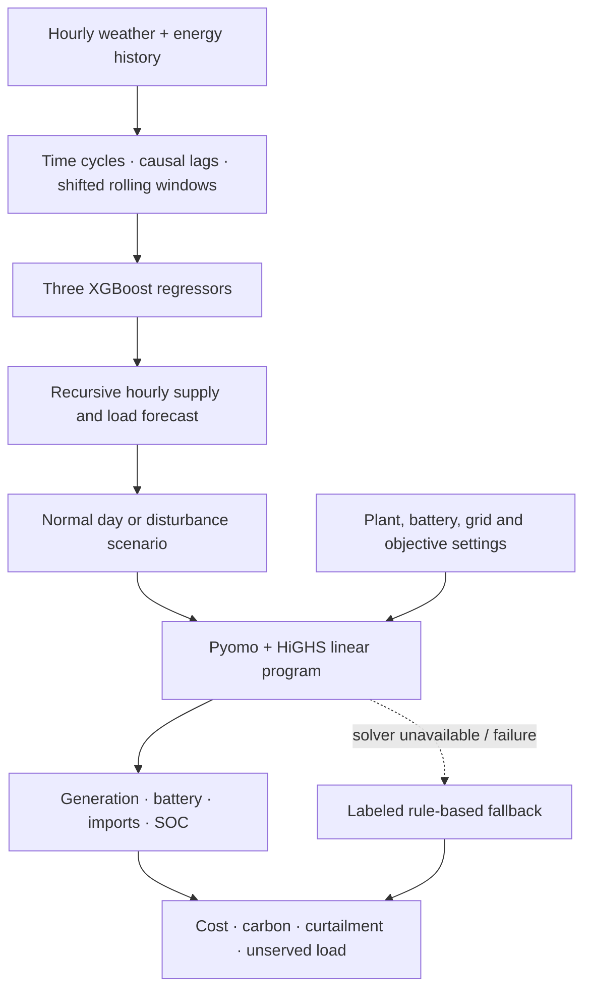
```mermaid
flowchart TB
    Data["Hourly weather + energy history"] --> Feat["Time cycles · causal lags · shifted rolling windows"]
    Feat --> XGB["Three XGBoost regressors"]
    XGB --> Forecast["Recursive hourly supply and load forecast"]
    Forecast --> Shock["Normal day or disturbance scenario"]
    Shock --> LP["Pyomo + HiGHS linear program"]
    Config["Plant, battery, grid and objective settings"] --> LP
    LP --> Dispatch["Generation · battery · imports · SOC"]
    LP -. "solver unavailable / failure" .-> Fallback["Labeled rule-based fallback"]
    Dispatch --> KPI["Cost · carbon · curtailment · unserved load"]
    Fallback --> KPI
```

| Layer | Details |
|---|---|
| Models | One `XGBRegressor` per target; 700 estimators, depth 7, learning rate 0.04, seed 42 |
| Features | Temperature, humidity, cloud, pressure, wind, radiation, cyclical time; lags 1–168 hours and shifted rolling windows |
| Validation | Chronological 70% / 15% / 15%; MAE, RMSE and sMAPE against lag-1 persistence |
| Future weather | Recursive prediction persists exogenous weather; no live numerical weather forecast is ingested |
| Optimizer | Continuous LP: hourly balance, power limits, battery efficiency / SOC, terminal reserve and weighted operating penalties |
| Scenarios | Cloud event, wind drop, load spike, low battery and grid outage |
| Failure behavior | Fallback carries its method and reason; it is not presented as optimal |

The base configuration is centred on Ahmedabad with **1,000 kW solar, 500 kW wind and a 2,000 kWh battery**. Equipment, tariffs and carbon settings are scenario assumptions. Unserved demand is explicit, so an outage cannot silently become a successful plan.

**Inspect:** [configuration](netzero-ai/configs/config.yaml) · [features](netzero-ai/src/features/features.py) · [training](netzero-ai/src/forecasting/train_all.py) · [optimizer](netzero-ai/src/optimization/model.py) · [scenarios](netzero-ai/src/simulation/scenarios.py) · [API](netzero-ai/api/main.py).

**Technology:** [XGBoost](https://github.com/dmlc/xgboost) · [Pyomo](https://github.com/Pyomo/pyomo) · [HiGHS](https://github.com/ERGO-Code/HiGHS).

<a id="task-3-earth"></a>

## Task 3 · Satellite deforestation and lake screening

Real **Sentinel-2 Level-2A** observations are accessed through Element 84 Earth Search. The pipeline crops cloud-optimized GeoTIFFs, applies radiometric scale/offset metadata, aligns dates to a shared **30 m UTM grid**, and excludes clouds, shadows and uncertain SCL quality classes.

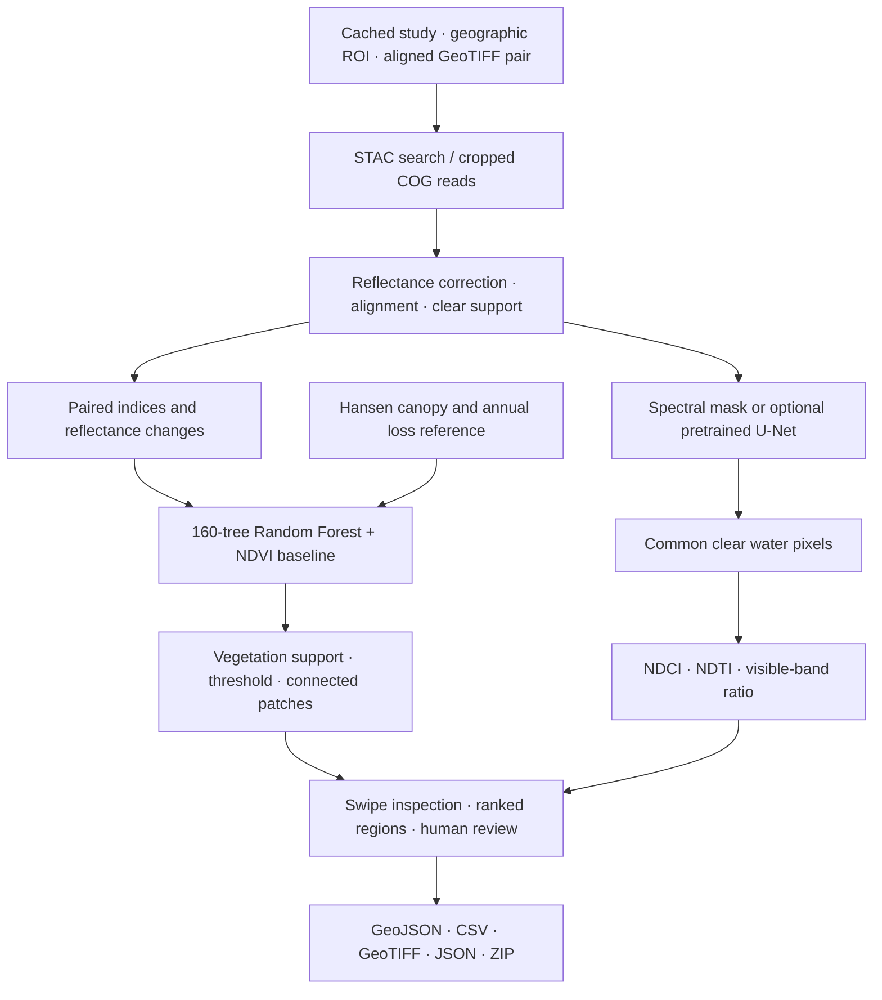
```mermaid
flowchart TB
    Input["Cached study · geographic ROI · aligned GeoTIFF pair"] --> Fetch["STAC search / cropped COG reads"]
    Fetch --> Align["Reflectance correction · alignment · clear support"]
    Align --> Forest["Paired indices and reflectance changes"]
    Align --> Water["Spectral mask or optional pretrained U-Net"]
    Forest --> RF["160-tree Random Forest + NDVI baseline"]
    Hansen["Hansen canopy and annual loss reference"] --> RF
    RF --> Patches["Vegetation support · threshold · connected patches"]
    Water --> Common["Common clear water pixels"]
    Common --> Indices["NDCI · NDTI · visible-band ratio"]
    Patches --> Review["Swipe inspection · ranked regions · human review"]
    Indices --> Review
    Review --> Export["GeoJSON · CSV · GeoTIFF · JSON · ZIP"]
```

### Forest-loss detector

The Rondônia study compares **2019-07-08** with **2024-07-21**. Its Random Forest uses **16 features**: before / after / difference NDVI, NBR, NDMI and MNDWI, plus red, NIR and two SWIR reflectance differences.

Labels use **Hansen GFC 2024 v1.12**, baseline canopy ≥30% and no earlier loss. Acquisition endpoint years are excluded; reference losses cover **2020–2023**. The western 70% trains the model and eastern 30% tests it, with a six-column exclusion gap: **9,449 training and 3,199 held-out samples**.

This evaluates reference-map agreement in **one scene pair**, not external geographic generalization or field-confirmed deforestation. Scores are uncalibrated. User-adjustable map filters change candidate hectares independently of classification metrics. Custom scenes use high baseline NDVI as a vegetation proxy when an independent forest map is unavailable.

### Lake-water workflow

Loktak Lake observations from **2020 and 2024** are compared. The optional upstream **U-Net segments water**; spectral ratios screen optical changes on common clear water pixels.

| Indicator | Formula | Interpretation |
|---|---|---|
| NDCI | `(B05 − B04) / (B05 + B04)` | Red-edge / red optical algae proxy |
| NDTI | `(B04 − B03) / (B04 + B03)` | Red / green turbidity proxy |
| Visible ratio | `(B04 + B03) / B02` | Additional visible-band screening ratio |

These **unitless indices** are not measured NTU, chlorophyll, sewage, pathogens, metals or drinking-water safety. Cached U-Net output has about **703 ha** of comparable water; the deployed spectral alternative reports about **1,015 ha**. Segmenter choice changes the comparison population and does not establish which mask is correct.

### Five observation-workspace capabilities

1. **Geographic input:** compact bounding-box fetches, plus map selection in the standalone app; public HTTPS imagery needs no Earth Engine account.
2. **Image input:** aligned eight-band GeoTIFFs; the standalone RGB studio compares pre-aligned PNG / JPEG pairs as visible-color screening.
3. **Swipe inspection:** before / after comparisons with change layers and candidate markers.
4. **Multi-date trends:** standalone prepared timelines and added acquisitions use common clear support.
5. **Review and export:** candidate decisions / notes are tied to actual inputs and masks, with annotated exports.

Unified Earth sheets expose case studies, coordinate-based fetches, GeoTIFF input, swipe inspection, review and export. Map drawing, RGB comparison and timeline controls are available in the standalone Streamlit interface.

**GeoTIFF contract:** `B02, B03, B04, B08, B11, B12, B05, SCL`; shared grid / extent; projected CRS in metres; correctly scaled reflectance. Convert raw DN containing a BOA offset before upload. RGB screening cannot produce georeferenced hectares or multispectral indices.

**Inspect:** [guide](Task3/README.md) · [metrics](Task3/models/metrics.json) · [scene processing](Task3/monitor/scenes.py) · [water adapter](Task3/monitor/water_model.py) · [outputs](Task3/outputs) · [sources / revisions](Task3/THIRD_PARTY_NOTICES.md).

<a id="task-4-carbon"></a>

## Task 4 · Industrial Scope 1, 2 and 3 carbon

SCOPE separates **activity-based accounting** from **ML estimates for missing activity data**. Fuel quantities and electricity bills use configured factors. The company estimator is a distinct synthetic-data demonstration.

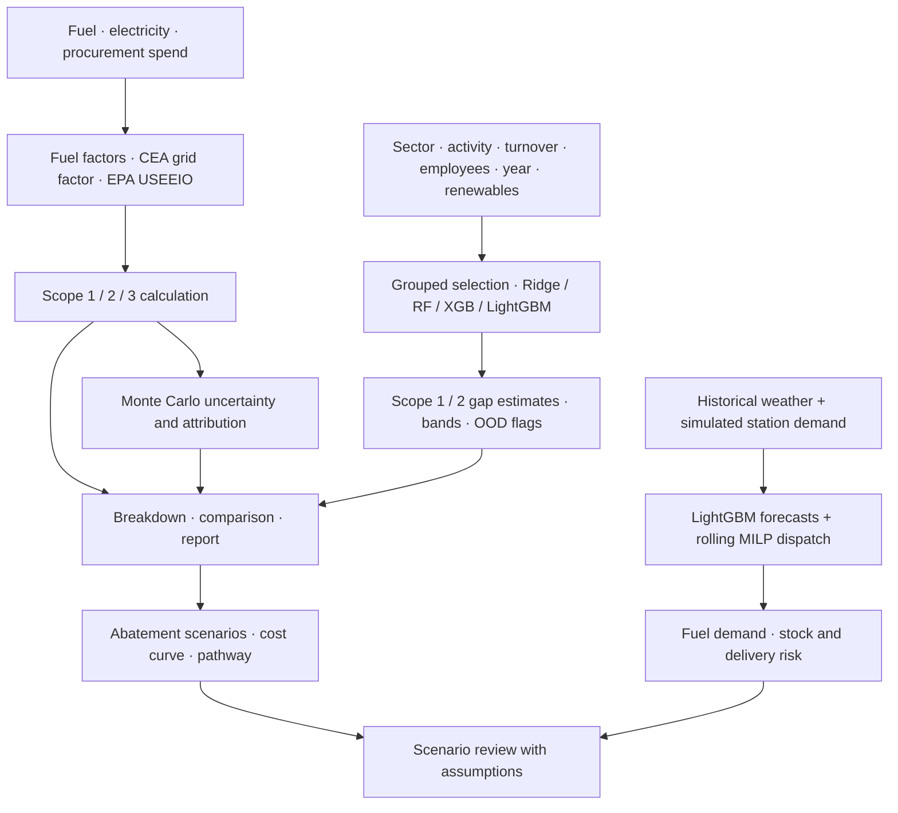
```mermaid
flowchart TB
    Inputs["Fuel · electricity · procurement spend"] --> Factors["Fuel factors · CEA grid factor · EPA USEEIO"]
    Factors --> Scope["Scope 1 / 2 / 3 calculation"]
    Scope --> MC["Monte Carlo uncertainty and attribution"]
    Profile["Sector · activity · turnover · employees · year · renewables"] --> ML["Grouped selection · Ridge / RF / XGB / LightGBM"]
    ML --> Estimate["Scope 1 / 2 gap estimates · bands · OOD flags"]
    Scope --> Report["Breakdown · comparison · report"]
    MC --> Report
    Estimate --> Report
    Report --> Abate["Abatement scenarios · cost curve · pathway"]
    Weather["Historical weather + simulated station demand"] --> MPC["LightGBM forecasts + rolling MILP dispatch"]
    MPC --> Runway["Fuel demand · stock and delivery risk"]
    Abate --> Decision["Scenario review with assumptions"]
    Runway --> Decision
```

| Scope / layer | Method and assumptions |
|---|---|
| Scope 1 | Fuel quantity × combustion factor, converted from kg to tonnes; combustion CO₂ only, excluding CH₄ / N₂O |
| Scope 2 | Electricity × **0.675 kg CO₂/kWh**, using the configured CEA v22 factor; optional transmission / distribution loss adjustment |
| Scope 3 | Spend at an assumed **₹85/USD** × **EPA USEEIO v1.3** sector factors; 1,016 factor sectors |
| Uncertainty | 5,000 Monte Carlo draws; assumed relative uncertainty of 5% fuel, 8% grid and 50% spend |
| ML gap-filler | Ridge, Random Forest, XGBoost, LightGBM candidates; company-grouped splits / CV; log targets; shipped Scope 1 and 2 models are Ridge |
| Explainability | SHAP, baseline comparisons, conformal intervals and out-of-distribution warnings |
| Abatement | Scenario levers, marginal abatement cost curves and illustrative pathways; solar / PPA overlap is controlled |

Factor accounting uses reference inputs; company ML labels are **synthetic**. Non-diesel fuel factors are approximate and should be verified for operational reporting. Scope 2 is location-based; market-based accounting is not implemented. U.S. spend-based factors applied to Indian procurement are approximate, not supplier measurements. Carbon accounting and microgrid carbon factors are separately configured.

### Additional planning: diesel dispatch and fuel runway

SCOPE's dispatch engine is separate from NetZeroAI's grid-tied LP. LightGBM forecasts feed a **rolling seven-day MILP** with generator starts / on-off states, fuel curves, battery dynamics and flexible demand. Real historical weather is combined with simulated station demand; the polar location is illustrative.

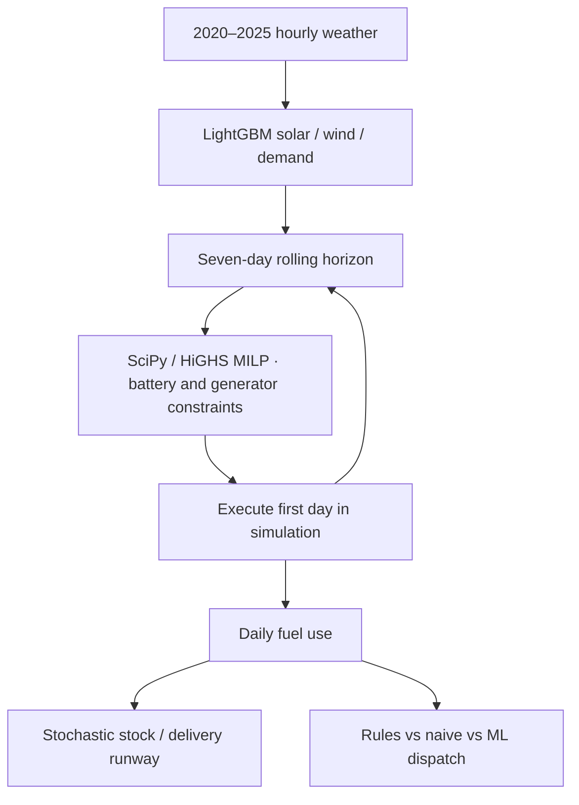
```mermaid
flowchart TB
    Hist["2020–2025 hourly weather"] --> Forecast["LightGBM solar / wind / demand"]
    Forecast --> Horizon["Seven-day rolling horizon"]
    Horizon --> MILP["SciPy / HiGHS MILP · battery and generator constraints"]
    MILP --> Execute["Execute first day in simulation"]
    Execute --> Horizon
    Execute --> Fuel["Daily fuel use"]
    Fuel --> Risk["Stochastic stock / delivery runway"]
    Fuel --> Compare["Rules vs naive vs ML dispatch"]
```

Saved polar simulation: **49,036 L/year** for rules versus **45,503 L/year** for ML dispatch, about **7.2% lower**. This is simulated fuel reduction, not measured station savings or guaranteed abatement.

**Inspect:** [calculator](SCOPE/carbon/calculator.py) · [factors](SCOPE/carbon/factors.py) · [Scope 3](SCOPE/carbon/scope3.py) · [training / calibration](SCOPE/carbon/train.py) · [abatement](SCOPE/carbon/abatement.py) · [MILP](SCOPE/carbon/milp.py) · [runway](SCOPE/carbon/runway.py).

## Model scorecard

Values come from saved reports and are rounded. They describe the stated evaluation population, not universal model accuracy.

| Pipeline | Measured result | Evaluation context / evidence |
|---|---|---|
| Noida · auto Random Forest · 14 days | **MAE 6.80 ppm**, persistence 8.05; nominal 90% band covers **82.2%** | 191 held-out targets; [metrics](task1/outputs/co2_noida/metrics.csv) |
| Ahmedabad · auto Lag Ridge · 14 days | **MAE 8.64 ppm**, persistence 5.67; nominal 90% band covers **51.3%** | 191 targets; loses to persistence; [metrics](task1/outputs/co2_ahmedabad/metrics.csv) |
| Forest Random Forest | **F1 0.802**, IoU 0.670, precision 0.772, recall 0.834 | Spatial holdout in one scene pair; [metrics](Task3/models/metrics.json) |
| Forest NDVI baseline | **F1 0.742**, IoU 0.590 | Same reference-test population; [metrics](Task3/models/metrics.json) |
| Carbon Scope 1 Ridge | **R² 0.966**, RMSE 0.549 on `log1p(tCO2e)` | Held-out synthetic companies; not “96.6% accuracy”; [metrics](SCOPE/results/metrics.json) |
| Carbon Scope 2 Ridge | **R² 0.925**, RMSE 0.514 on `log1p(tCO2e)` | Held-out synthetic companies; [metrics](SCOPE/results/metrics.json) |
| Polar ML dispatch | **7.2% less simulated fuel** than rules | Annual simulation; [report](SCOPE/results/dispatch/polar.json) |
| Microgrid XGBoost | MAE / RMSE / sMAPE generated by training | Synthetic data; rebuild `netzero-ai/models/metrics.json`; [code](netzero-ai/src/forecasting/train_all.py) |
| Lake U-Net | Pretrained water segmentation; no local pollution accuracy claim | [Adapter](Task3/monitor/water_model.py); field calibration needed |

Air selection minimizes **calibration RMSE among ML candidates**, without choosing on the test results. Carbon training uses grouped out-of-fold residuals for shipped cross-conformal calibration; saved reports retain interval-selection diagnostics. Nominal coverage is not guaranteed by sector or under distribution shift.

## Dataset catalog

| Dataset / source | Status | Use | Provenance / access |
|---|---|---|---|
| **NOAA CarbonTracker CT2026** | Real regional model product; cached city extracts | Regional CO₂ training / backtests | [Product](https://gml.noaa.gov/ccgg/carbontracker/CT2026/) · [manifest](task1/data/cities/manifest.json) · [DOI](https://doi.org/10.25925/hqp0-rk68) |
| **NOAA GML stations** | Earlier cached CO₂ / CH₄ workflows | Standalone Atmos / regression coverage | [GML](https://gml.noaa.gov/ccgg/trends/data.html) · [manifest](task1/data/manifest.json) |
| **Copernicus Sentinel-2 L2A** | Real scenes; optional custom fetch | Forest / lake observations | [Earth Search](https://element84.com/earth-search/) · [STAC](https://earth-search.aws.element84.com/v1) · [metadata](Task3/data) |
| **Hansen GFC 2024 v1.12** | Real satellite-derived reference | Canopy support / annual loss labels | [Downloads / terms](https://storage.googleapis.com/earthenginepartners-hansen/GFC-2024-v1.12/download.html) · [paper](https://doi.org/10.1126/science.1244693) |
| **CEA baseline database v22** | Configured factor | Indian electricity footprint | [Database](https://cea.nic.in/cdm-co2-baseline-database/?lang=en) · [implementation](SCOPE/carbon/factors.py) |
| **EPA USEEIO v1.3** | Bundled supply-chain factor table | Spend-based Scope 3 | [EPA](https://www.epa.gov/land-research/us-environmentally-extended-input-output-useeio-models) · [CSV](SCOPE/data/raw/useeio_v1.3.csv) |
| **Synthetic company-year data** | Generated demonstration | Carbon training / stress tests | [Generator](SCOPE/carbon/data_synth.py) · [declaration](SCOPE/data/processed/DATA_SOURCE.txt) |
| **Open-Meteo historical weather** | Real cached weather for SCOPE; optional NetZeroAI loader | Simulated station dispatch / features | [API](https://open-meteo.com/en/docs/historical-weather-api) · [loader](SCOPE/carbon/weather.py) |
| **Seeded microgrid data** | Default synthetic hourly data | Solar / wind / load training | [Generator](netzero-ai/src/data/generate_demo_data.py) |
| **PVGIS** | Optional downloader; not default training data | Location-specific solar input | [European Commission](https://re.jrc.ec.europa.eu/pvg_tools/en/) · [loader](netzero-ai/src/data/download_pvgis.py) |
| **UCI household electricity** | Optional downloader; requires site adaptation | Example measured load | [Dataset](https://archive.ics.uci.edu/dataset/235/individual+household+electric+power+consumption) · [loader](netzero-ai/src/data/download_uci.py) |
| **Natural Earth** | Bundled geographic context | Offline Atmos map | [Public-domain terms](https://www.naturalearthdata.com/about/terms-of-use/) · [notice](task1/assets/NATURAL_EARTH_LICENSE.md) |

Access to data does not validate a model for a new city, lake, company or power system. Follow source citations and terms when redistributing data.

### Related GitHub repositories and attribution

| Repository | Actual use |
|---|---|
| [AwasthiAshutosh/TerraVision](https://github.com/AwasthiAshutosh/TerraVision) · MIT | Adapted SCL masking, NDVI screening and dashboard workflow |
| [NightSongs/Forest-CD](https://github.com/NightSongs/Forest-CD) · MIT | Paired-image research reference; its network is not the executed forest model |
| [Iulia-plesu/lake-detection-water-quality](https://github.com/Iulia-plesu/lake-detection-water-quality) · Apache-2.0 | Optional U-Net architecture / checkpoint and normalization reference |
| [RAJohansen/waterquality](https://github.com/RAJohansen/waterquality) · MIT | Spectral ratio forms ported to NumPy with nearby Sentinel-2 bands |
| [Element84/earth-search](https://github.com/Element84/earth-search) | Public catalog and Sentinel asset-access documentation |
| [stanfordmlgroup/methane-gapfill-ml](https://github.com/stanfordmlgroup/methane-gapfill-ml) | Atmospheric ML research context; methane-flux gap filling differs from this CO₂ forecast |

Exact satellite revisions, licenses, modifications and U-Net SHA256 are in [THIRD_PARTY_NOTICES.md](Task3/THIRD_PARTY_NOTICES.md). Reference checkouts are not committed. Upstream models and datasets retain their own attribution and licenses.

## Quick start

### Option A · Docker

The root image builds the website and Python environments and regenerates seeded microgrid data / models.

```bash
git clone https://github.com/neevmodh/Polaris.git
cd Polaris
docker build -t polaris .
docker run --rm -p 3100:3100 polaris
```

Open **[localhost:3100](http://localhost:3100)**. The image does not include optional U-Net architecture / large weights; the lake workflow uses its labeled spectral alternative.

For the analyst, copy `.env.example` to `.env`, set your key, and add `--env-file .env` to `docker run`. Keep the key on the server; `.env` is Git-ignored.

### Option B · Local development

Use **Node.js 22** and **Python 3.12**. A fresh clone does not contain virtual environments, `node_modules` or every regenerable model.

```bash
git clone https://github.com/neevmodh/Polaris.git
cd Polaris

# Separate engine dependency sets.
for engine in SCOPE task1 Task3 netzero-ai; do
  python3.12 -m venv "$engine/.venv"
  "$engine/.venv/bin/python" -m pip install -r "$engine/requirements.txt"
done

# Required for a fresh microgrid checkout.
(cd netzero-ai && .venv/bin/python -m src.data.generate_demo_data)
(cd netzero-ai && .venv/bin/python -m src.forecasting.train_all)

(cd Polaris/web && npm ci)
./run.sh
```

The root script builds if needed and serves **3100**. Frontend development: `npm run dev` inside `Polaris/web` (default port 3000). Small carbon / forest models and prepared observations ship with the repo. Air models train and cache on first use.

```dotenv
# Optional; scientific sheets work without the analyst.
GROQ_API_KEY=
GROQ_MODEL=openai/gpt-oss-120b
```

The analyst receives computed figures and a question. It is not the forecasting model, accounting calculator or solver. Generated explanations can still be wrong; panels expose their source figures.

### Standalone apps and artifact rebuilds

| Component | Command from its directory | Notes |
|---|---|---|
| Atmos | `./run.sh` in `task1` | Streamlit 8501; maps, CSV input and exports |
| Satellite Monitor | `bash run.sh` in `Task3` | Streamlit 8503; map drawing, RGB studio and timeline |
| NetZeroAI | `PATH="$PWD/.venv/bin:$PATH" bash run_demo.sh` in `netzero-ai` | Generates / trains, then FastAPI 8000; [API docs](http://localhost:8000/docs) |
| SCOPE | `.venv/bin/streamlit run app.py` in `SCOPE` | Standalone accounting / planning dashboard |
| Carbon ML | `make data train` in `SCOPE` | Regenerates **synthetic** training data |
| SCOPE dispatch | `.venv/bin/python -m carbon.dispatch_eval polar community` in `SCOPE` | Regenerates forecasters and simulation reports |
| Satellite data / forest | `.venv/bin/python scripts/bootstrap_data.py --preset all` then `.venv/bin/python scripts/train_forest.py` in `Task3` | Network required for data rebuild |
| Satellite timelines / reports | `.venv/bin/python scripts/bootstrap_timeline.py` then `.venv/bin/python scripts/build_reports.py` in `Task3` | See engine prerequisites |

For optional lake U-Net inference, install `Task3/requirements-water.txt`, clone the **pinned** upstream lake repository following [the satellite guide](Task3/README.md) and [notices](Task3/THIRD_PARTY_NOTICES.md), then run `scripts/setup_water_model.py` with Task3's interpreter. It verifies size and SHA256. The upstream architecture and approximately 118 MiB checkpoint are excluded from this repository.

If native dependencies are missing, use Docker or install the platform runtime; the image includes OpenMP and Expat. Preserve compatible scikit-learn versions for shipped joblib artifacts. Only load trusted model files.

## Workspace and API index

| Section | Website sheets | API surface |
|---|---|---|
| Carbon | [01 Calculator](https://polaris-web-production-bb75.up.railway.app/carbon) · [02 Estimator](https://polaris-web-production-bb75.up.railway.app/carbon/estimate) · [03 Compare](https://polaris-web-production-bb75.up.railway.app/carbon/compare) · [Report](https://polaris-web-production-bb75.up.railway.app/carbon/report) | `/api/meta`, `/api/calc`, `/api/predict`, `/api/report` |
| Air | [04 Forecast](https://polaris-web-production-bb75.up.railway.app/air/forecast) · [05 Alerts](https://polaris-web-production-bb75.up.railway.app/air/alerts) | `/api/air/{cmd}` |
| Plan | [06 Abatement](https://polaris-web-production-bb75.up.railway.app/plan/abatement) · [07 Dispatch](https://polaris-web-production-bb75.up.railway.app/plan/dispatch) · [08 Microgrid](https://polaris-web-production-bb75.up.railway.app/plan/microgrid) · [09 Runway](https://polaris-web-production-bb75.up.railway.app/plan/runway) | `/api/abatement`, `/api/dispatch/*`, `/api/grid/{cmd}`, `/api/runway` |
| Earth | [10 Forest](https://polaris-web-production-bb75.up.railway.app/earth/forest) · [11 Lake](https://polaris-web-production-bb75.up.railway.app/earth/lake) | `/api/sat/{cmd}`; GeoTIFF upload uses multipart |
| Evidence | [12 Carbon models](https://polaris-web-production-bb75.up.railway.app/evidence/carbon) · [13 Earth models](https://polaris-web-production-bb75.up.railway.app/evidence/earth) · [14 Method](https://polaris-web-production-bb75.up.railway.app/evidence/method) | Saved reports / engine metadata |
| Analyst | Supported sheet panels | `GET /api/ask` status; `POST /api/ask` explanation |

Commands are allow-listed by route; not every worker capability is exposed on the website. [Route handlers](Polaris/web/app/api) define request shapes. The standalone microgrid FastAPI service is separate.

## Deployment

[Dockerfile](Dockerfile) and [railway.json](railway.json) define a single-container deployment. Railway supplies `PORT`; `/api/ask` is the health check. A web health check is not a complete scientific-engine readiness check.

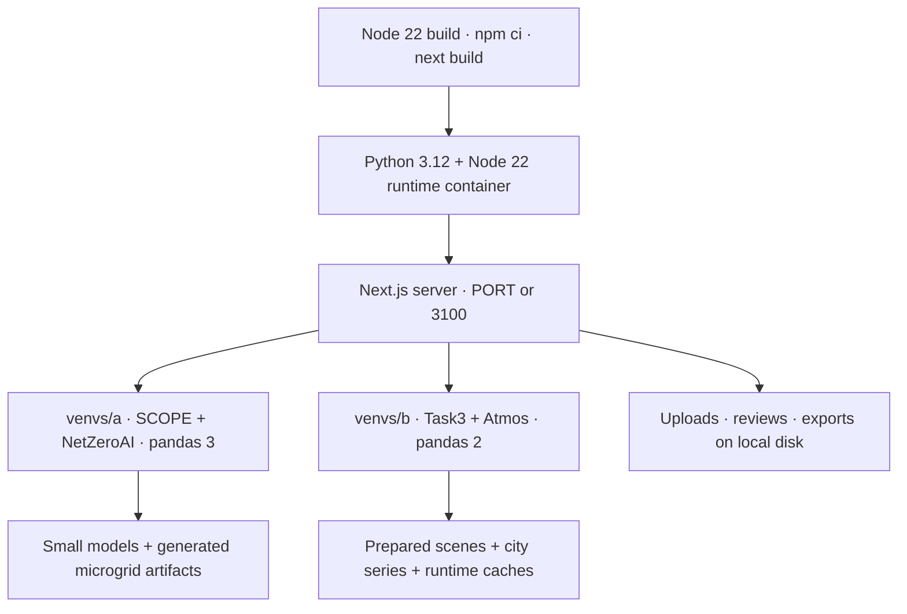
```mermaid
flowchart TB
    Build["Node 22 build · npm ci · next build"] --> Container["Python 3.12 + Node 22 runtime container"]
    Container --> Next["Next.js server · PORT or 3100"]
    Next --> A["venvs/a · SCOPE + NetZeroAI · pandas 3"]
    Next --> B["venvs/b · Task3 + Atmos · pandas 2"]
    A --> Models["Small models + generated microgrid artifacts"]
    B --> Cached["Prepared scenes + city series + runtime caches"]
    Next --> Disk["Uploads · reviews · exports on local disk"]
```

Local development has four environments; deployment shares **two compatible dependency groups**. Overrides: `SCOPE_DIR`, `TASK1_DIR`, `TASK3_DIR`, `NETZERO_DIR` and corresponding `*_PYTHON` paths.

Review notes, uploads and caches use container disk; they do not survive redeployment without persistent storage. Authentication, durable storage and access controls are deployment work before private multi-user operational use.

## Verification and reproducibility

Scientific-engine tests, worker integration tests and browser checks are included. Run them after setup; this documentation update does not claim a fresh full application test run.

```bash
(cd SCOPE && .venv/bin/python -m pytest -q)
(cd task1 && .venv/bin/python -m pytest -q)
(cd Task3 && .venv/bin/python -m pytest -q)
(cd netzero-ai && .venv/bin/python -m pytest -q)

# Worker integration + carbon + browser checks.
# Requires the site on :3100 and a compatible Chrome installation.
(cd Polaris && make test)

(cd Polaris/web && npm run lint)
(cd Polaris/web && npm run build)
```

Seeded generators, committed factor tables / reports, scene IDs and radiometric metadata, city manifests, controlled splits and analysis packages support reproduction. Changed source data or library versions can change outputs.

| Evidence | Records |
|---|---|
| [City verification](task1/outputs/CITY_VERIFICATION.md) | Extraction, historical coverage and forecasting checks |
| [Air provenance](task1/outputs/co2_noida/provenance.json) | Source and settings |
| [Forest metrics](Task3/models/metrics.json) | Split, labels, confusion matrix and baseline |
| [Satellite notices](Task3/THIRD_PARTY_NOTICES.md) | Upstream revisions, citations and weight checksum |
| [Carbon metrics](SCOPE/results/metrics.json) | Grouped holdout, error and interval diagnostics |
| [Carbon stress report](SCOPE/results/stress.json) | Fresh synthetic stress population and audits |
| [Polar dispatch](SCOPE/results/dispatch/polar.json) | Simulated fuel comparison |

## Repository layout

```text
POLARIS/
├── README.md                  Architecture, models, data and setup
├── run.sh                     Unified website launcher
├── Dockerfile                 Web build + Python runtime
├── railway.json               Deployment settings
├── deploy/                    Two pinned deployment dependency groups
├── Polaris/
│   ├── web/                   Next.js UI, APIs, charts and browser checks
│   ├── engines/               JSON-lines engine adapters
│   └── tests/                 Worker integration tests
├── task1/                     Atmos regional greenhouse-gas forecasts
│   ├── src/                   Data, forecasts, maps and reports
│   ├── data/                  NOAA station / city data and manifests
│   └── outputs/               Forecasts, backtests and evidence
├── netzero-ai/                Renewable microgrid forecast + dispatch
│   ├── src/                   Data, features, models and optimizer
│   ├── api/                   Standalone FastAPI service
│   ├── configs/               Equipment and grid assumptions
│   └── frontend/              Standalone dashboard
├── Task3/                     Satellite forest and lake monitor
│   ├── monitor/               Scenes, indices, review and export
│   ├── scripts/               Data / training / weight rebuilds
│   ├── models/                Forest model and evidence
│   └── outputs/               Maps, rasters and packages
├── SCOPE/                     Accounting, ML and planning
│   ├── carbon/                Factors, estimates, MILP and runway
│   ├── data/                  Factors, synthetic companies and weather
│   └── results/               Evaluation reports and plots
└── docs/                      README assets and hackathon documents
```

## Interpretation and current limits

| Area | Current boundary | Next validation step |
|---|---|---|
| Air | Coarse historical product, imperfect bands; Ahmedabad loses to persistence | Updated observations, local sensors and baseline-aware deployment |
| Forest | One scene pair; candidate change is not confirmed clearing | External spatial / temporal tests and expert / field review |
| Lake | Optical proxies affected by mask, shoreline and floating vegetation | Paired local water samples and calibration |
| Carbon ML | Synthetic labels; log-space scores do not establish industrial accuracy | Verified disclosures / activity with grouped validation |
| Scope 3 | U.S. sector factors and assumed exchange rate | Supplier-specific activity / suitable regional factors |
| Microgrid | Synthetic default data, persisted weather and assumed assets / tariff | Site meters, future weather and prospective testing |
| Dispatch / runway | Simulated demand and assumed delivery processes | Operational records and risk calibration |
| Deployment | Ephemeral disk and no multi-user isolation | Persistent storage, authentication and monitoring |

## Project documents and credits

- [Final-round proposal](docs/Polaris_Final_Round_Proposal.pdf)
- [CarbonIQ project document](docs/Polaris_CarbonIQ.pdf)
- [Greenovators brochure](docs/Brochure%20Greenovators%20hackathon.pdf)
- [Hackathon schedule](docs/Hackathon%20Program%20Schedule.pdf)
- [Event poster](docs/Hackathon%207-9%20Oct%202026%20Poster%202.png)
- Engine guides: [Atmos](task1/README.md) · [NetZeroAI](netzero-ai/README.md) · [Satellite Monitor](Task3/README.md) · [SCOPE](SCOPE/README.md)

**Team CarbonIQ · Greenovators Hackathon 2026 · Track 3.** Open scientific datasets and upstream projects are credited above. There is currently no repository-wide license file; an upstream MIT or Apache license does not automatically cover every POLARIS file or dataset.
